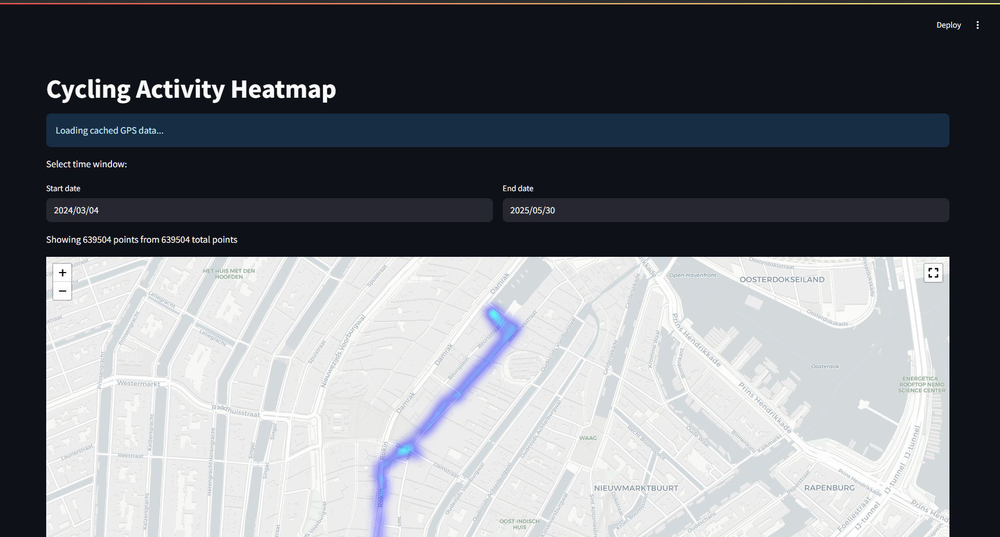

# Apple Fitness Activity Heatmap Generator

A Python application that creates an interactive heatmap visualization of your Apple Fitness activities from exported GPX files. This tool is specifically designed to work with GPX files exported from Apple Fitness/Health app, helping you visualize your workout routes and identify your most frequented paths.

## Screenshot



## Features

- **Interactive Heatmap**: Visualize your Apple Fitness workout routes with an intensity-based heatmap
- **Time Window Selection**: Filter activities by date range to focus on specific periods
- **Efficient Data Processing**: 
  - Caches processed GPS data for faster subsequent runs
  - Shows progress while processing GPX files
- **Interactive Map Controls**:
  - Fullscreen mode
  - Zoom and pan capabilities
  - Clean, modern map interface

## Requirements

- Python 3.x
- Required packages:
  - streamlit
  - gpxpy
  - folium
  - pandas
- Apple Fitness/Health app with exported GPX files

## Installation

1. Clone this repository
2. Install the required packages:
```bash
pip install streamlit gpxpy folium pandas
```

## Usage

1. Export your workout data from Apple Fitness/Health app as GPX files
2. Place the exported GPX files in the `workout-routes` directory
3. Run the application:
```bash
streamlit run generate.py
```
4. The application will:
   - Process your Apple Fitness GPX files (only on first run)
   - Open a web interface in your browser
   - Allow you to select a date range
   - Display the heatmap of your workout activities

## Data Processing

- The application processes Apple Fitness GPX files only once and caches the results
- Cached data is stored in `processed_gps_data.pkl`
- To reprocess your data (e.g., after exporting new workouts), simply delete the cache file

## Notes

- The heatmap intensity represents the frequency of your workout routes
- Darker areas indicate more frequently traveled paths
- The map is centered on your first recorded activity
- Works with any workout type from Apple Fitness that includes GPS data (cycling, running, walking, etc.) 